# voss

Deploy to your own VPS. One command.

<p align="center">
  
</p>

## What is this

voss is a self-hosted deployment platform. Like Vercel, but on your own server.

- **CLI-first.** `voss deploy` and you're done.
- **Zero config.** Auto-detects Next.js, Vite, Astro, Remix, Nuxt, SvelteKit, Dockerfile.
- **Auto-detects everything.** Package manager (npm/pnpm/yarn/bun), monorepo structure, framework.
- **SHA dedup.** Only uploads changed files. 361KB instead of 220MB.
- **Instant rollback.** `voss rollback` swaps to the previous deployment in seconds.
- **Auto SSL.** Traefik + Let's Encrypt. `voss domains add example.com` and HTTPS just works.
- **Web dashboard.** Projects, deployments, env vars, domains, logs, activity feed.
- **GitHub integration.** Auto-deploy on push. Preview deploys on PRs. PR comments with URL.
- **Notifications.** Slack, Telegram, Discord webhooks on deploy success/fail.
- **Build cache.** Persistent `node_modules` between deploys. 3-5x faster rebuilds.
- **Your server, your rules.** SSH in, see real logs, full control.

## Quick start

### 1. Setup your VPS (Ubuntu/Debian, 2GB+ RAM)

```bash
curl -fsSL https://raw.githubusercontent.com/beautyfree/voss/main/scripts/install.sh | sudo bash
```

This installs Docker, Traefik, Bun, and voss-server. Takes ~2 minutes. Outputs an API key.

### 2. Connect from your laptop

```bash
bun i -g voss
voss login <your-server-ip> <api-key>
```

### 3. Deploy

```bash
cd my-next-app
voss deploy
```

That's it. Your app is live at `https://my-next-app.yourdomain.com`.

## CLI Commands

| Command | What it does |
|---------|-------------|
| `voss deploy` | Deploy current project |
| `voss deploy --preview` | Create a preview deployment |
| `voss deploy --verbose` | Deploy with detailed output |
| `voss status` | Show current deployment status |
| `voss logs` | Stream deployment logs |
| `voss rollback` | Rollback to previous deployment |
| `voss env set KEY=VALUE` | Set environment variable |
| `voss env get` | List environment variables |
| `voss env delete KEY` | Delete environment variable |
| `voss domains add example.com` | Add custom domain with auto-SSL |
| `voss domains remove example.com` | Remove domain |
| `voss domains` | List domains |
| `voss link [repo-url]` | Link GitHub repo for auto-deploy |
| `voss projects` | List all deployed projects |
| `voss whoami` | Show connected server info |
| `voss init` | Create voss.json config |

## Web Dashboard

The dashboard is served at `http://your-server:3456` and includes:

- **Projects list** with status indicators
- **Project detail** with 5 tabs:
  - **Overview** — framework, status, domain, repo URL, latest deploy info
  - **Deployments** — list with live log streaming (WebSocket) and saved log viewer
  - **Environment** — add/delete env vars with build-time flag
  - **Domains** — add/delete custom domains with SSL status
  - **Activity** — event feed (deploys, rollbacks, env changes)
- **Server status** — uptime, disk usage, running containers with CPU/RAM/network
- **Redeploy & Rollback** buttons
- **Toast notifications** on all actions
- **Landing page** with feature overview and vs-Vercel comparison

API is type-safe end-to-end via Eden Treaty (Elysia typed client).

## GitHub Integration

### Auto-deploy on push

1. Link your repo: `voss link` (auto-detects git remote)
2. Add webhook in GitHub repo settings:
   - **URL:** `https://your-server:3456/api/webhook/github`
   - **Secret:** your `VOSS_API_KEY`
   - **Events:** Push, Pull requests
3. Push to main → auto-deploy. Open PR → preview deploy. Close PR → cleanup.

### PR preview comments

Set `GITHUB_TOKEN` env var on the server to get preview URLs posted as PR comments.

## Notifications

Configure a webhook URL per project (via dashboard or API):

- **Slack:** Incoming webhook URL
- **Telegram:** Bot API URL with chat_id
- **Discord:** Webhook URL
- **Generic:** Any URL — receives JSON payload

## voss.json

Optional. voss auto-detects everything, but you can override:

```json
{
  "name": "my-app",
  "framework": "nextjs",
  "rootDirectory": "apps/web",
  "buildCommand": "pnpm run build",
  "startCommand": "pnpm start",
  "healthCheck": {
    "path": "/api/health",
    "timeout": 120
  },
  "resources": {
    "memory": "1536m",
    "cpu": 1
  }
}
```

## Supported Frameworks

| Framework | Detection | Runner |
|-----------|-----------|--------|
| Dockerfile | `Dockerfile` | Custom build |
| Next.js | `next.config.*` | node:20-slim |
| Vite | `vite.config.*` | node:20-slim |
| Astro | `astro.config.*` | node:20-slim |
| Remix | `remix.config.*` | node:20-slim |
| Nuxt | `nuxt.config.*` | node:20-slim |
| SvelteKit | `svelte.config.*` | node:20-slim |
| Bun | `bunfig.toml` | oven/bun:1.3 |
| Node.js | `package.json` | node:20-slim |
| Static | `index.html` | node:20-slim |

Package managers: npm, pnpm, yarn, bun — auto-detected from lock files.

Monorepos: turbo, pnpm workspaces — auto-detected or set `rootDirectory`.

## Architecture

```
Your laptop                         Your VPS ($5/mo)
+-----------+                       +---------------------------+
|  voss CLI | ---HTTPS/WS-------->  |  Traefik (reverse proxy)  |
|           |    SHA dedup upload   |    auto-SSL, routing      |
+-----------+                       +---------------------------+
                                    |  voss-server (ElysiaJS)   |
                                    |    API, deploy pipeline,  |
                                    |    SQLite, WebSocket,     |
                                    |    dashboard SPA          |
                                    +---------------------------+
                                    |  Docker containers        |
                                    |    your-app:3000          |
                                    |    preview-branch:3000    |
                                    +---------------------------+
```

**Stack:**
- **CLI:** Bun + TypeScript. Bundles to single file.
- **Server:** ElysiaJS + Drizzle + bun:sqlite. Single process.
- **Dashboard:** Vite + React 19 SPA. Eden Treaty typed client.
- **Routing:** Traefik file provider. Auto-SSL via Let's Encrypt.
- **Containers:** Runner images or custom Dockerfile. Code mounted at start.
- **Deploy:** Upload changed files → build in container → health check → swap routing.
- **Background jobs:** SSL checker (hourly), log cleanup (6h), image prune.

**Database tables:** projects, deployments, env_vars, aliases, domains, events.

## API

All routes require `Authorization: Bearer <API_KEY>` except health and webhooks.

| Method | Route | Description |
|--------|-------|-------------|
| GET | `/api/health` | Health check |
| GET | `/api/stats` | Container + system stats |
| GET | `/api/projects` | List projects |
| GET | `/api/projects/:name` | Get project + latest deploy |
| PATCH | `/api/projects/:name` | Update project (repoUrl, notifyUrl) |
| DELETE | `/api/projects/:name` | Delete project + full cleanup |
| POST | `/api/deploy/manifest` | SHA dedup check |
| POST | `/api/deploy/upload/:name` | Upload tar.gz |
| POST | `/api/deploy/start` | Trigger deploy |
| GET | `/api/deployments/:id` | Deployment status |
| GET | `/api/deployments/:id/logs` | Saved deploy logs |
| GET | `/api/projects/:name/deployments` | List deployments |
| POST | `/api/projects/:name/redeploy` | Redeploy with last config |
| POST | `/api/projects/:name/rollback` | Rollback to previous |
| GET | `/api/projects/:name/env` | List env vars (masked) |
| POST | `/api/projects/:name/env` | Set env var |
| DELETE | `/api/projects/:name/env/:key` | Delete env var |
| GET | `/api/projects/:name/domains` | List domains |
| POST | `/api/projects/:name/domains` | Add domain |
| DELETE | `/api/projects/:name/domains/:hostname` | Remove domain |
| GET | `/api/projects/:name/events` | Activity feed |
| POST | `/api/webhook/github` | GitHub webhook |
| WS | `/ws/logs/:deploymentId` | Live log stream |

## Development

```bash
git clone https://github.com/beautyfree/voss.git
cd voss
bun install
bun test

# Run CLI locally
bun run packages/cli/src/index.ts --help

# Run server locally (needs Docker)
VOSS_API_KEY=test bun run packages/server/src/index.ts

# Run dashboard dev server
cd packages/dashboard && bun run dev
```

## License

MIT
